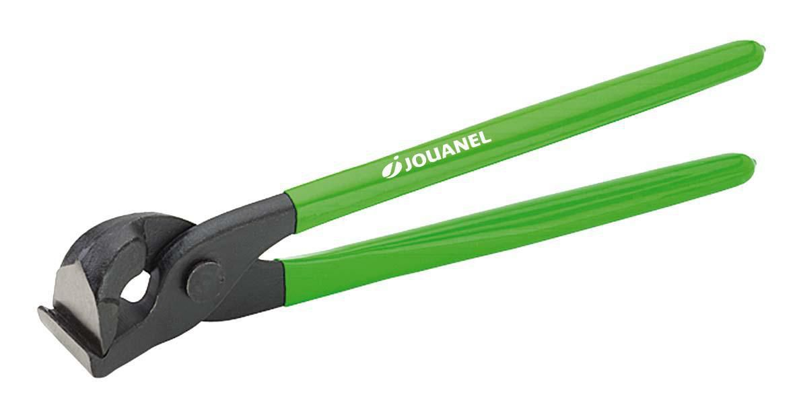

## This lecture

- This lecture will expand on data *wrangling* using tidyverse verbs and pipes
- We use the following packages
```{r warning=FALSE, message=FALSE}
library(MASS)     # for the cats data (oh yes...)
library(dplyr)    # data manipulation
library(tidyr)    # pipes
```

# Data manipulation with `dplyr`

## What is `dplyr`
- To the best of my knowledge a pun based on a deplier...

</img>

## The `dplyr` verbs
- The core functions of `dplyr` are suggestive verbs
    - `filter` for subsetting rows (observations)
    - `select` for subseting columss (variables)
    - `arrange` for sorting variables
    - `mutate` for making new variables
- We will see how these compare to our previous way of doing things while enjoying...    

## The cats data
```{r}
head(cats)
```

```{r}
str(cats)
```

## Selecting rows
- We have already seen how to select **rows** using a logical query as index, e.g. all female cats
```{r}
cats2 <- cats[cats$Sex == "F", ]
dim(cats2)
head(cats2, n=3)
```

## Selecting rows with `dplyr`
- The same can be accomplished by using the `filter` verb (or function) from `dplyr`
```{r}
cats2a <- filter(cats, Sex=="F")
dim (cats2a)
head(cats2, n=3)
```

## Selecting columns
- With only female cats in the `cats2` data frame we no longer need the *gender* coloumn
```{r}
cats3 <- cats2[,-1]
dim(cats3)
```

- Let us verify that selecting **columns** either by positive or negative indexing yields the same result
```{r}
identical(cats2[,2:3], cats2[,-1])
```

## Selecting columns with `dplyr`
- To select columns with functions from `dplyr` use the `select` function
```{r}
cats3a <- select(cats2a, -Sex)
dim(cats3a)
```
- Again two approaches are possible
```{r}
identical(select(cats2a, -Sex), select(cats2a, Bwt, Hwt))
```

## A small notice about `select`
- If you load the library `MASS` after `dplyr`, then `select` refers to a function from the former package ratehr than the latter
- We can specificy that we want to use the function from `dplyr` by writing
```{r eval=FALSE}
cats3a <- dplyr::select(cats2a, Bwt, Hwt)
```
- But often this can be avoided by loading packages in a specific order


## Sorting
- Are the female cats data frame sorted after heart weight? 
```{r}
!is.unsorted(cats3$Hwt)
```
- Let us sort them using index technique
```{r}
cats3 <- cats3[order(cats3$Hwt),]
```
- Test again
```{r}
!is.unsorted(cats3$Hwt)
```

## Sorting with `dplyr`
- Sorting can be done a bit easier with `dplyr` verb `arrange`
```{r}
!is.unsorted(cats3a$Hwt)
cats3a <- arrange(cats3a, Hwt)
```
- Test again
```{r}
!is.unsorted(cats3a$Hwt)
```

## Making new variables
- Calculate the ratio between body weight and heart weight and find the mean
```{r}
cats3$ratio <- cats3$Bwt / cats3$Hwt
mean (cats3$ratio)
```

## Making new variables with `dplyr`
- The relevant verb is `mutate`
```{r}
cats3a <- mutate (cats3a, ratio = Bwt / Hwt)
mean (cats3a$ratio)
```


<!-- # Basic analysis -->

<!-- ## Correlation -->

<!-- ```{r} -->
<!-- cor(cats[, -1]) -->
<!-- ``` -->
<!-- With `[, -1]` we exclude the first column -->

<!-- ## Correlation -->
<!-- ```{r} -->
<!-- cor.test(cats$Bwt, cats$Hwt) -->
<!-- ``` -->

<!-- What do we conclude? -->

<!-- ## Correlation -->

<!-- ```{r fig.height=5, fig.width=5, dev.args = list(bg = 'transparent'), fig.align='center'} -->
<!-- plot(cats$Bwt, cats$Hwt) -->
<!-- ``` -->

<!-- ## T-test -->
<!-- Test the null hypothesis that the difference in mean heart weight between male and female cats is 0 -->
<!-- ```{r} -->
<!-- t.test(formula = Hwt ~ Sex, data = cats) -->
<!-- ``` -->

<!-- ## T-test -->
<!-- ```{r fig.height=5, fig.width=5, dev.args = list(bg = 'transparent'), fig.align='center'} -->
<!-- plot(formula = Hwt ~ Sex, data = cats) -->
<!-- ``` -->

# Pipes

## What is a pipe?
- A reference to a number of connected tubes or *pipes* transporting an item or substance from one place to another...
</img>

## Sequential calculations
- In the previous example we calculated the mean ratio between body weight and heart weight for female cats through a number of steps
- First we used indexing methods:
```{r}
cats2 <- cats[cats$Sex == "F", ]
cats3 <- cats2[,-1]
cats3$ratio <- cats3$Bwt / cats3$Hwt
mean (cats3$ratio)
```

## Still sequential
- Then we did the same using `dplyr` verbs
```{r}
cats2a <- filter(cats, Sex == "F")
cats3a <- dplyr::select(cats2a, -Sex)
cats3a <- mutate(cats3a, ratio = Bwt / Hwt)
mean (cats3a$ratio)
```
- If we are only interested in this number, we leave a lot of intermediate steps...

## What if...
- What if we immediately could send the result from one step to the next step?
- This is possible using the pipe-operator `%>%`
- It takes some key board strokes so you might want to learn Ctrl+Shift+M...

## First application of pipe
- We now calulate the same result but leave no traces behind
```{r}
cats %>% 
  filter(Sex == "F") %>% 
  mutate(ratio = Bwt / Hwt) %>% 
  summarise (mean(ratio))
```
- Notice that we used a new verb `summarise` rather that piping directly into `mean` - this *could* be done but requires a few extra tricks...

## Saving the result from a pipe
- We can also save the result if needed later
```{r}
m <- cats %>% 
  filter(Sex == "F") %>% 
  mutate(ratio = Bwt / Hwt) %>% 
  summarise (mean(ratio))
m
class(m)
```

## Grouped calculations
- What about the male cats, why not see result for both sexes?
```{r}
cats %>% 
  group_by(Sex) %>% 
  mutate(ratio = Bwt / Hwt) %>% 
  summarise (mean(ratio))
```

## A small table of summary statistics
- Perhaps with other information as weel?
```{r}
cats %>% 
  group_by(Sex) %>% 
  mutate(ratio = Bwt / Hwt) %>% 
  summarise (n=n(), mb=mean(Bwt), mh=mean(Hwt), mr=mean(ratio))
```

## Pipes with benefits 
- Your code becomes more readable:
    - data operations are structured from left-to-right and not from in-to-out
    - nested function calls are avoided
    - local variables and copied objects are avoided
    - easy to add steps in the sequence
- See the [Data Wrangling Cheat Sheet](https://www.rstudio.com/wp-content/uploads/2015/02/data-wrangling-cheatsheet.pdf) for many more possibilities
